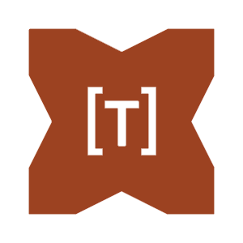

# hxtomlc17

  



Haxe/hxcpp @:native bindings for [tomlc17](https://github.com/cktan/tomlc17)

> [!IMPORTANT]  
> This library works on the C++ target only!

## Installation

via haxelib

```bash
haxelib install hxtomlc17
```

via git for the latest updates

```bash
haxelib git hxtomlc17 https://github.com/Vortex2Oblivion/hxtomlc17.git
```

## Usage

```haxe
package;

import cpp.RawFILE;
import cpp.RawFILE.*;
import cpp.RawPointer;
import hxtomlc17.Toml;
import hxtomlc17.TomlDatum;
import hxtomlc17.TomlResult;

class Main {
 static function error(msg:String, ?msg1:Int) {
  Sys.println('ERROR: $msg${Std.string(msg1) ?? ""}');
  Sys.exit(1);
 }

 static function main() {
  var fp:RawPointer<RawFILE> = fopen("simple.toml", "r");

  if (fp == null) {
   error("cannot open simple.toml - ");
  }

  var result:TomlResult = Toml.parseFile(fp);

  fclose(fp);

  if (!result.ok) {
   error(result.errmsg, 0);
  }

  var server:TomlDatum = Toml.tableFind(result.toptab, "server");
  var host:TomlDatum = Toml.tableFind(server, "host");
  var port:TomlDatum = Toml.tableFind(server, "port");

  if (host.type != TOML_STRING) {
   error("missing or invalid 'server.host' property in config", 0);
  }

  Sys.println('server.host = ${host.u.s}');

  if (port.type != TOML_ARRAY) {
   error("missing or invalid 'server.port' property in config", 0);
  }

  Sys.print("server.port = [");

  for(i in 0...port.u.arr.size){
   var elem:TomlDatum = port.u.arr.elem[i];
   if(elem.type != TOML_INT64){
    error("server.port element not an integer", 0);
   }
   Sys.print('${i != 0 ? ", " : ""}${elem.u.int64}');
  }
  Sys.println("]");

  Toml.free(result);
 }
}
```
